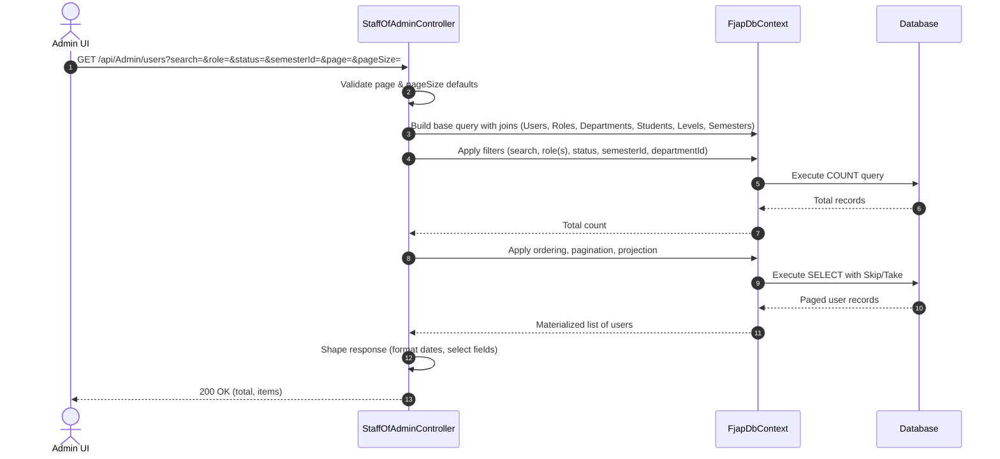

# Sequence Diagram - Admin View User List

```mermaid
sequenceDiagram
    autonumber
    actor Admin as Admin UI
    participant API as StaffOfAdminController
    participant DbContext as FjapDbContext
    participant DB as Database

    Admin->>API: GET /api/Admin/users?search=&role=&status=&semesterId=&page=&pageSize=
    API->>API: Validate page & pageSize defaults
    API->>DbContext: Build base query with joins (Users, Roles, Departments, Students, Levels, Semesters)
    API->>DbContext: Apply filters (search, role(s), status, semesterId, departmentId)
    DbContext->>DB: Execute COUNT query
    DB-->>DbContext: Total records
    DbContext-->>API: Total count
    API->>DbContext: Apply ordering, pagination, projection
    DbContext->>DB: Execute SELECT with Skip/Take
    DB-->>DbContext: Paged user records
    DbContext-->>API: Materialized list of users
    API->>API: Shape response (format dates, select fields)
    API-->>Admin: 200 OK (total, items)
```
